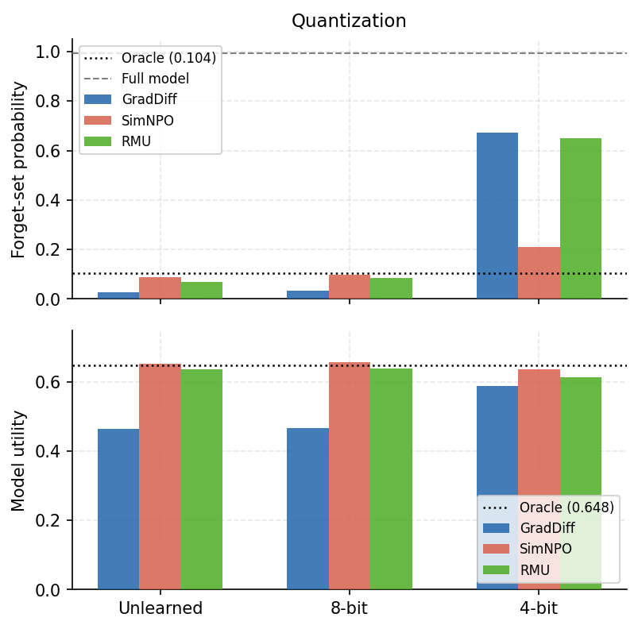
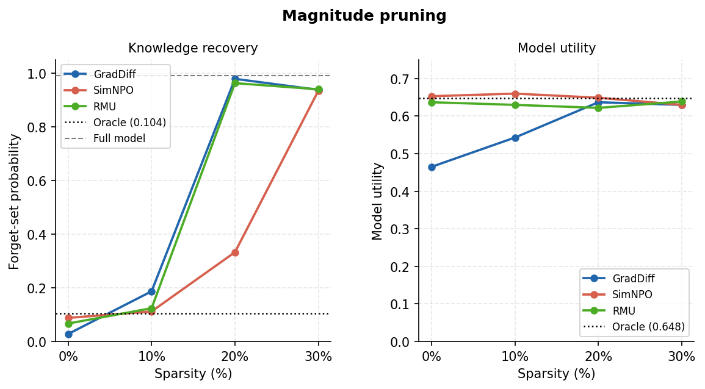

# Compression Reverses Machine Unlearning: Replication and Extension on TOFU

---

## 1. Introduction

Zhang et al. (2024) showed that applying 4-bit quantization to LLMs that have undergone machine unlearning recovers a substantial fraction of the supposedly forgotten knowledge, while 8-bit quantization has negligible effect. Their experiments used the MUSE benchmark with Llama-2-7B across six unlearning methods.

We replicate this finding on TOFU, a different benchmark with a different model family (Llama-3.1-8B-Instruct), and extend it to magnitude pruning, a structurally different compression method not tested in the original paper. We test three unlearning methods that differ substantially in mechanism: GradDiff, SimNPO, and RMU.

---

## 2. Background

### 2.1 The TOFU benchmark

TOFU (Maini et al. 2024) is a question-answering benchmark built around 450 entirely fabricated author profiles, each with 20 question-answer pairs (9,000 pairs total). Because the authors and their biographical details are invented, the forget set contains no information the model could have encountered during pretraining. This eliminates the confound present in MUSE — where a model evaluated on Harry Potter or BBC news articles may retain knowledge from pretraining exposure rather than from the specific fine-tuning that is being unlearned.

The *forget10* split designates 10% of authors (45 authors, 900 QA pairs) as the forget set. The remaining 90% form the retain set. Experiments use two reference models drawn from the open-unlearning HuggingFace repository: a *full* model trained on all 450 authors, and a *retain90* oracle trained from scratch on only the retain-set authors. The oracle represents the target state for a perfectly unlearned model — behaviour on the forget set indistinguishable from a model that was never exposed to it.

### 2.2 How MUSE differs

MUSE (Shi et al. 2024) uses two real-data splits: NEWS (BBC articles from after August 2023) and BOOKS (the Harry Potter series). Its primary metrics are ROUGE-based: VerbMem measures verbatim reproduction, KnowMem measures QA performance using questions generated by GPT-4. It also includes a membership inference attack metric (PrivLeak).

The key difference for our purposes is the confound: real data creates uncertainty about whether knowledge "recovery" after compression reflects the unlearning failure or baseline pretraining exposure. TOFU's synthetic forget set removes this ambiguity. The tradeoff is that TOFU's forget-set knowledge is artificially implanted during fine-tuning rather than naturally acquired, which may affect how it is stored and how unlearning interacts with it.

Direct numerical comparison between our results and Zhang et al.'s is not possible — TOFU uses probability-based metrics and MUSE uses ROUGE-based metrics, and the models differ. We assess directional consistency rather than magnitude agreement.

### 2.3 Evaluation metrics

We use the open-unlearning evaluation harness throughout. Two metrics drive our analysis:

**`forget_Q_A_Prob`** is the average joint token probability the model assigns to the correct answer, given the question, across all forget-set QA pairs. This is a direct measure of how confidently the model can produce the correct forget-set answers. Low values indicate suppressed knowledge; high values indicate retained or recovered knowledge. This is our primary metric for measuring knowledge recovery after compression.

**`model_utility`** is the harmonic mean of nine sub-metrics across three evaluation domains: the retain set, a real-authors QA set, and a world-facts QA set. Each domain contributes probability, ROUGE, and truth-ratio sub-metrics. The harmonic mean penalises degradation in any single dimension. This is our primary metric for confirming that compression has not simply degraded the model generally.

We also report `forget_quality` (a Kolmogorov-Smirnov test comparing the unlearned model's forget-set behaviour to the retain90 oracle) for context, but do not use it as a primary analysis metric.

### 2.4 Unlearning methods

**GradDiff (α=1)** performs gradient ascent on the forget set — increasing the cross-entropy loss on forget-set QA pairs — simultaneously with gradient descent on the retain set, weighted by α=1. This is equivalent to the GA_GDR method in Zhang et al.

**SimNPO** adapts Negative Preference Optimisation without a reference model, treating the forget set as negative preference data and training the model to assign low likelihood to forget-set completions while a retain-set term preserves utility. We use hyperparameters lr=2e-5, beta=4.5, delta=1.0, gamma=0.25, 10 epochs.

**RMU (Representation Misdirection for Unlearning)** steers the internal representations of the network toward a random control vector rather than suppressing output probabilities directly. A steering loss is applied at a target layer (layer 7 of 32) to misdirect activations on forget-set inputs, while a retain loss maintains normal representations on retain-set inputs. We use hyperparameters lr=1e-5, steering coefficient 2, 10 epochs.

All three checkpoints were trained by us on a single H100 using the open-unlearning training harness.

### 2.5 Compression methods

**Quantization** is applied at load time using bitsandbytes via HuggingFace's `BitsAndBytesConfig`. At 4-bit, we use NF4 (Normal Float 4), a non-uniform 16-level quantization format optimised for normally distributed weights, with computation in float16. At 8-bit, we use LLM.int8(), which applies row-wise absmax scaling with a separate high-precision pathway for outlier weights. Both are post-training quantization methods — no retraining or calibration data is involved. These are the same two precision levels tested by Zhang et al., though their implementation used RTN (round-to-nearest) rather than NF4 for 4-bit.

**Magnitude pruning** is applied after loading the model in float16. We collect all weight values from every linear layer, compute a global threshold at the target sparsity percentile, and zero all weights below that threshold in-place. Pruning is global rather than per-layer: a weight in one layer competes against weights in all layers, so sparsity is not uniform across the network. We test 10%, 20%, and 30% sparsity.

---

## 3. Results

### 3.1 Reference points

| Checkpoint | forget_Q_A_Prob | model_utility |
|---|---|---|
| Full model | 0.992 | 0.627 |
| Retain90 oracle | 0.104 | 0.648 |
| GradDiff | 0.028 | 0.465 |
| SimNPO | 0.088 | 0.653 |
| RMU | 0.067 | 0.637 |

All three unlearning methods achieve forget_Q_A_Prob below the oracle threshold of 0.104. GradDiff achieves the strongest suppression (0.028) but at the cost of substantial utility loss (0.465 vs oracle 0.648). SimNPO and RMU both achieve suppression below the oracle while maintaining model utility at or near oracle level (0.653 and 0.637 respectively).

### 3.2 Quantization

**Knowledge recovery** (`forget_Q_A_Prob`, lower = better unlearning):

| | Unlearned | 8-bit | 4-bit |
|---|---|---|---|
| GradDiff | 0.028 | 0.033 | **0.672** |
| SimNPO | 0.088 | 0.096 | **0.210** |
| RMU | 0.067 | 0.083 | **0.649** |

*Oracle: 0.104. Full model ceiling: 0.992.*

**Model utility** (`model_utility`, higher = better):

| | Unlearned | 8-bit | 4-bit |
|---|---|---|---|
| GradDiff | 0.465 | 0.467 | 0.589 |
| SimNPO | 0.653 | 0.657 | 0.636 |
| RMU | 0.637 | 0.638 | 0.614 |

*Oracle: 0.648.*

**8-bit** has negligible effect across all three methods — forget_Q_A_Prob increases by at most 0.016 and model utility is essentially unchanged.

**4-bit** produces large knowledge recovery in all cases while model utility is preserved or improved. GradDiff and RMU are similarly vulnerable (0.672 and 0.649), recovering to roughly two-thirds of full-model probability. SimNPO is substantially more robust (0.210), consistent with the larger weight perturbations SimNPO produces being less completely erased by quantization. All three methods remain above the oracle threshold of 0.104 after 4-bit quantization.

### 3.3 Magnitude pruning

**Knowledge recovery** (`forget_Q_A_Prob`, lower = better unlearning):

| | Unlearned | 10% | 20% | 30% |
|---|---|---|---|---|
| GradDiff | 0.028 | 0.187 | **0.979** | **0.938** |
| SimNPO | 0.088 | 0.112 | 0.333 | **0.935** |
| RMU | 0.067 | 0.124 | **0.963** | **0.940** |

*Oracle: 0.104.*

**Model utility** (`model_utility`, higher = better):

| | Unlearned | 10% | 20% | 30% |
|---|---|---|---|---|
| GradDiff | 0.465 | 0.543 | 0.637 | 0.630 |
| SimNPO | 0.653 | 0.660 | 0.649 | 0.630 |
| RMU | 0.637 | 0.630 | 0.622 | 0.639 |

*Oracle: 0.648.*

Recovery increases with sparsity for all three methods, and model utility is preserved throughout — at no pruning level does any method fall substantially below oracle utility. At 30% sparsity, GradDiff (0.938), SimNPO (0.935), and RMU (0.940) all recover nearly all suppressed knowledge. The three methods converge to the same outcome at 30%, despite showing different trajectories at lower sparsity: GradDiff and RMU reach near-full recovery already at 20% (0.979 and 0.963), while SimNPO requires 30% to reach comparable levels.

### 3.4 Weight delta analysis

To understand why the methods differ in their vulnerability to compression, we computed per-weight deltas (W_unlearned − W_full) across all linear layers for each method and measured two properties: the magnitude of weight changes, and whether those changes land disproportionately on the low-magnitude weights that magnitude pruning removes first.

**Change magnitude.** SimNPO makes substantially larger weight changes than the other two methods — per-element delta norms are 2–4× larger than GradDiff's across all module types, and 3–4× larger than RMU's.

| Module type | GradDiff | SimNPO | RMU |
|---|---|---|---|
| MLP down | 2.5e-5 | 5.4e-5 | 1.7e-5 |
| MLP gate/up | 2.3e-5 | 5.2e-5 | 1.4e-5 |
| Attention QKV | 2.4e-5 | 4.9e-5 | 1.3e-5 |
| Attention out | 2.8e-5 | 5.7e-5 | 1.7e-5 |

*Normalized magnitude of weight changes (W_unlearned − W_full), averaged across elements.*

This is consistent with SimNPO's relative robustness to 4-bit quantization: larger changes are harder to round away. The difference in magnitude likely reflects the loss functions themselves — SimNPO's preference-based objective drives weights further from the pre-unlearning state than gradient ascent (GradDiff) or targeted activation steering (RMU).

**Pruning overlap.** We also measured whether the weights that changed most under unlearning are concentrated in the low-magnitude weights that magnitude pruning zeros first. We report an enrichment ratio: 1.0 means the highest-delta weights are uniformly distributed across the weight magnitude spectrum; values above 1.0 mean they cluster in the pruned region.

| Module type | GradDiff | SimNPO | RMU |
|---|---|---|---|
| MLP down | 7.6× | 5.2× | 2.3× |
| MLP gate/up | 5.8× | 5.7× | 2.5× |
| Attention QKV | 2.9× | 6.1× | 1.9× |
| Attention out | 6.9× | 4.8× | 2.1× |

*Enrichment of high-delta weights in the bottom-10% lowest-magnitude weights (what 10% pruning removes).*

GradDiff's unlearning signal is heavily concentrated in low-magnitude MLP weights — 76% of its highest-delta MLP down-projection weights fall in the bottom 10% lowest-magnitude weights. This directly explains why even 10–20% pruning substantially reverses GradDiff's unlearning. RMU's changes are more spread across the weight magnitude spectrum (only 23% concentrated in the pruned zone), yet full recovery still occurs by 30% pruning. SimNPO shows intermediate concentration, but its larger absolute changes mean more signal remains in the non-pruned weights even after the concentrated portion is removed.

---

## 4. Discussion

**Replication.** 4-bit quantization reverses substantial forget-set knowledge on TOFU across all three methods tested. 8-bit quantization has negligible effect. This replicates the directional finding of Zhang et al. on a different benchmark, a different model family, and with a synthetic forget set that removes the pretraining confound. The finding holds for methods that differ substantially in mechanism: gradient ascent on outputs (GradDiff), preference-based suppression (SimNPO), and activation-space misdirection (RMU).

**Pruning as an additional vector.** Magnitude pruning also reverses unlearning at 8B scale, with recovery increasing monotonically with sparsity and model utility preserved throughout. At 30% global sparsity, all three methods recover nearly all suppressed knowledge while remaining fully functional. This is a structurally different compression mechanism from quantization — it removes weight components entirely rather than rounding them — suggesting the vulnerability is not specific to the quantization operation.

**Method differences.** SimNPO is more robust to 4-bit quantization than GradDiff or RMU (0.210 vs 0.672/0.649). At the same time, SimNPO converges to the same near-full recovery at 30% pruning as the other methods. The weight delta analysis offers a partial explanation: SimNPO makes 2–4× larger weight changes than GradDiff or RMU, which makes its signal harder to erase by quantization rounding. Its pruning resistance at low sparsity follows from the same property — even where its changes are concentrated in low-magnitude weights, the larger absolute magnitude means more signal survives after those weights are removed. At 30% pruning, enough of the signal is eventually removed regardless.

**The common denominator.** All three unlearning methods, despite their different objectives, store forget-set suppression in a form that is disrupted by both weight quantization and weight removal. The weight delta analysis shows why: across all methods, the unlearning perturbations are small enough that quantization rounds them back toward the original weights, and concentrated enough in low-magnitude weights that pruning removes them. A method that genuinely erased knowledge rather than suppressing its surface expression might be expected to produce larger, more distributed weight changes that survive compression; none of the methods tested here do.

---

## 5. Next steps

**Replication on MUSE.** The most direct extension would be to run the same compression sweep on MUSE (NEWS and BOOKS splits) with Llama-3.1-8B. MUSE uses ROUGE-based metrics (VerbMem, KnowMem) and includes a membership inference metric (PrivLeak), so the results would not be directly comparable numerically, but directional consistency would strengthen the case that the vulnerability is benchmark-agnostic. The main complication is the pretraining confound — MUSE's real-data splits mean some knowledge recovery may reflect pretraining exposure rather than unlearning failure, which TOFU avoids by design.

**Additional unlearning methods.** The open-unlearning framework supports several methods not tested here. NPO (Negative Preference Optimisation, the reference-model variant of SimNPO) and SCRUB are the most natural additions. Task-vector-based approaches, which construct an "unlearning direction" in weight space and subtract it, would be particularly interesting to test against compression: their unlearning perturbation is explicitly directional, which may make it more or less susceptible to quantization rounding than the perturbations produced by gradient-based methods.

**Larger models.** All experiments here use Llama-3.1-8B. It would be interesting to replicate the sweep at larger scales — 70B or beyond — to check whether the vulnerability persists. Larger models may encode knowledge more redundantly, which could make unlearning perturbations harder to reverse, or alternatively more distributed across weights, which could make them more susceptible to compression-induced disruption.

**Additional compression methods.** We tested two compression families — quantization (PTQ via bitsandbytes) and unstructured magnitude pruning. Several others are worth examining: GPTQ and AWQ are calibration-data-based quantization methods that produce different rounding decisions than the PTQ approach used here; structured pruning removes entire attention heads or MLP channels rather than individual weights and would interact differently with the unlearning perturbation; and low-rank approximation (SVD truncation) compresses by discarding small singular value components, which could disproportionately affect the low-magnitude perturbations that unlearning introduces.
